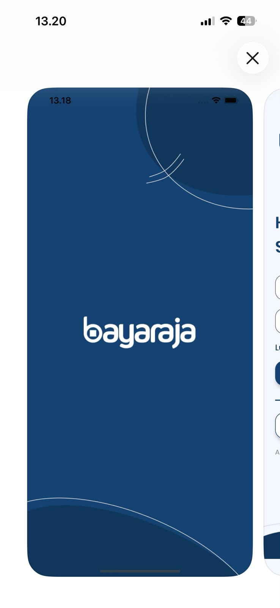
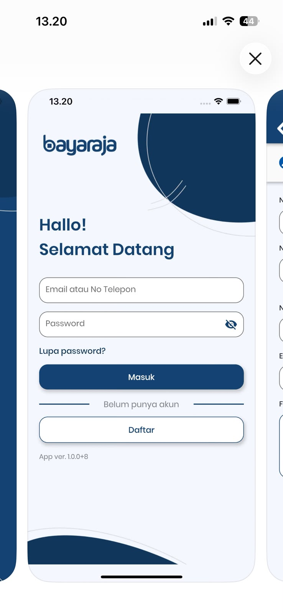
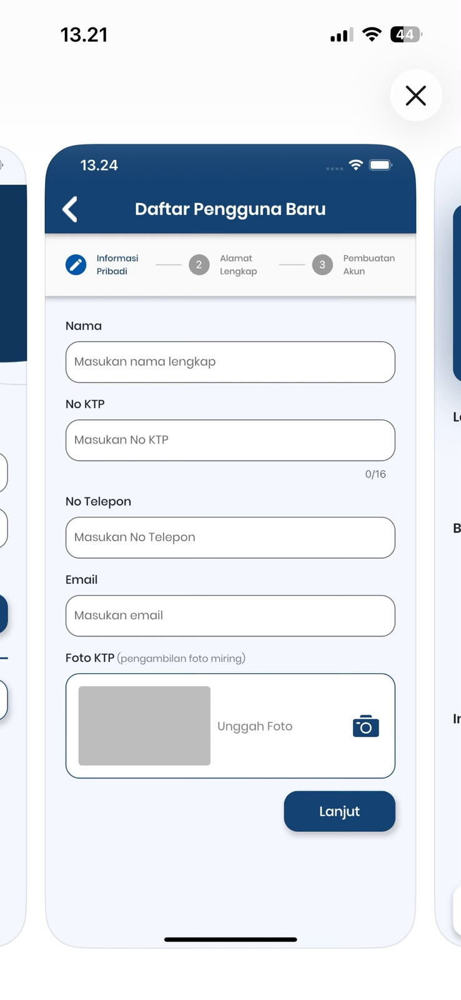
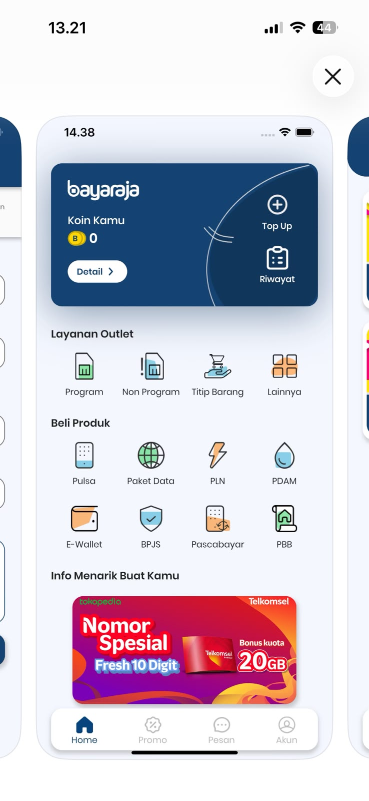
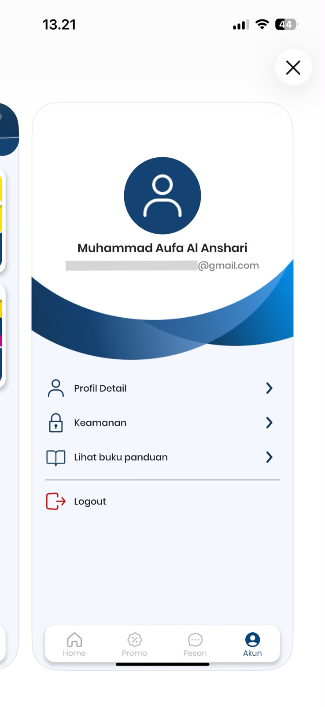

# Hi, I'm Rifardo 👋

### Senior Full-Stack Engineer | Mobile Developer | Technical Lead

Experienced software engineer with 7+ years of professional experience designing, developing, and delivering enterprise-scale mobile and backend systems. Specialized in Flutter (Android/iOS) and Golang backend development, with a proven track record of leading cross-functional teams and delivering production-ready applications used by thousands of users across Indonesia.

---

## About Me

I build scalable mobile and backend applications, lead technical teams, and coordinate project delivery from planning to production deployment.

My expertise includes:

* Mobile Development (Flutter, Android)
* Backend Development (Golang REST API)
* System Architecture
* Agile & Scrum Delivery
* Technical Leadership
* Stakeholder Management
* Enterprise Application Development

Currently working as a Senior Full-Stack Developer & Mobile Engineer at Kisel Group, where I lead development initiatives for enterprise platforms across HR, finance, cooperative management, telecommunications, and healthcare sectors.

---

## Tech Stack

### Mobile

* Flutter
* Dart
* Android (Java)
* Android (Kotlin)

### Backend

* Golang
* REST API
* Node.js (Basic)
* Java

### Database

* PostgreSQL
* MySQL

### ERP

* Odoo
* Adempiere

### Tools

* Git
* Jira
* Postman
* Docker
* Termius

### Reporting & Analytics

* Tableau
* Power BI

---

## Professional Experience

### Senior Full-Stack Developer / Mobile Engineer

**Kisel Group** | Aug 2019 - Present

* Led end-to-end delivery of enterprise mobile and backend systems.
* Coordinated Product Managers, QA Engineers, UI/UX Designers, and Vendors.
* Conducted sprint planning, backlog management, and progress tracking using Jira.
* Served as Technical Lead and stakeholder liaison.
* Mentored junior developers and performed code reviews.
* Designed and developed scalable backend systems using Golang.
* Built Flutter applications for enterprise users.

### IT Programmer

**PT Global Service Indonesia** | Jul 2018 - Jul 2019

* Developed mobile applications for PT United Tractors.
* Built executive dashboards using Tableau and Power BI.
* Collaborated with business stakeholders to deliver operational solutions.

---

## Featured Projects

### BayarAja

**Tech Lead, Mobile Developer & Backend Architect**

Multi-level PPOB platform with stock distribution flow:

Warehouse → Cluster → TAP → Salesforce

Key Contributions:

* Backend Architecture Design
* Golang REST API Development
* Flip API Integration
* Sprint Planning & Delivery Management

#### Screenshots

  
  
  '
  
  
  

---

### Marissa HRMS & HRIS Attendance System

**Full-Stack Lead**

Enterprise HR platform serving 500+ employees.

Tech Stack:

* Flutter
* Golang
* PostgreSQL

Responsibilities:

* Requirement Gathering
* Architecture Design
* Development
* Deployment
* Production Support

---

### PPNI Nurse Platform

**Backend Engineer & Project Coordinator**

National-scale platform supporting Indonesian nurses.

Responsibilities:

* Backend API Development
* Vendor Coordination
* Milestone Tracking
* Stakeholder Communication

---

## Education

**Bachelor of Informatics Engineering**
Gunadarma University

GPA: 3.01 / 4.00

Final Project:
Mobile-Based Introduction of West Sumatera Tourism

---

## Currently Exploring

* Golang Microservices
* Docker & DevOps
* System Design
* Cloud Infrastructure
* AI-Assisted Development

---

## Connect With Me

📧 Email: [brongkeinyong@gmail.com](mailto:brongkeinyong@gmail.com)

💼 LinkedIn: [linkedin.com/in/rifardo](https://linkedin.com/in/rifardo)

🐙 GitHub: [github.com/BrongKeinyong](https://github.com/BrongKeinyong)

📍 Bogor, West Java, Indonesia
